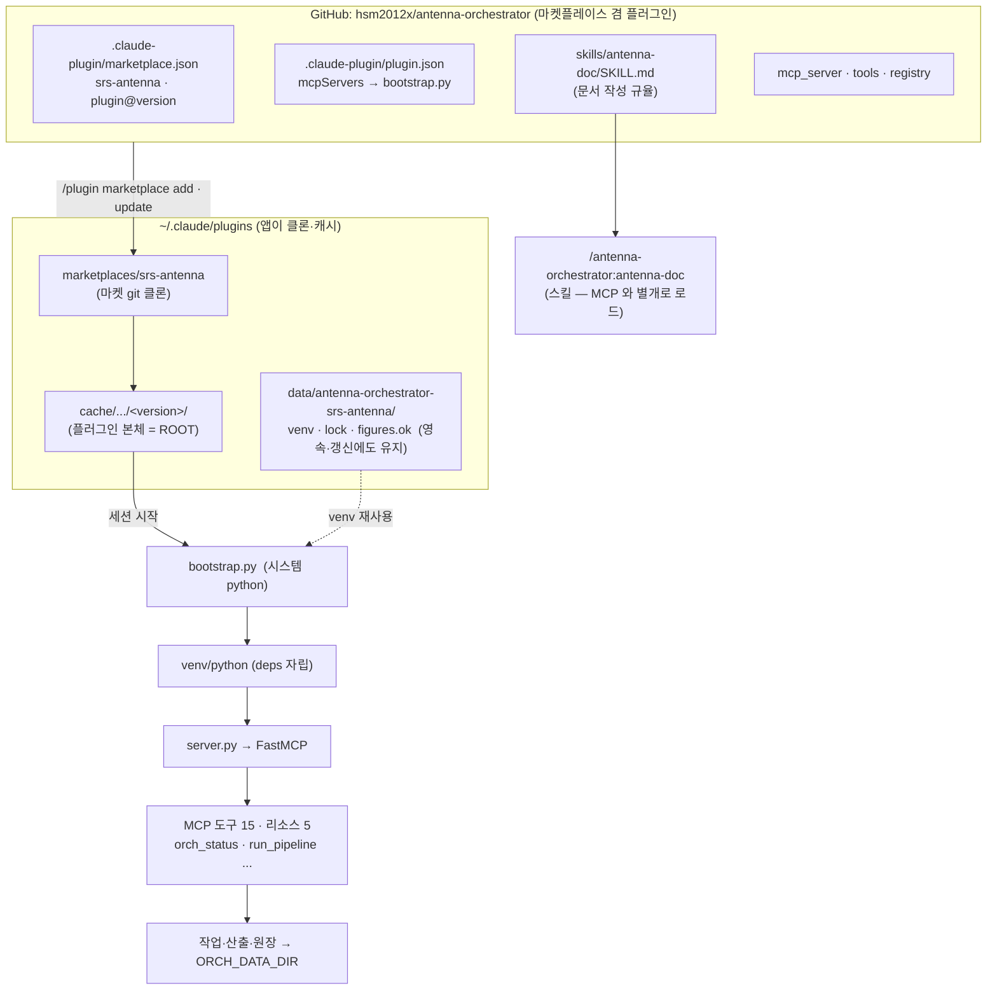
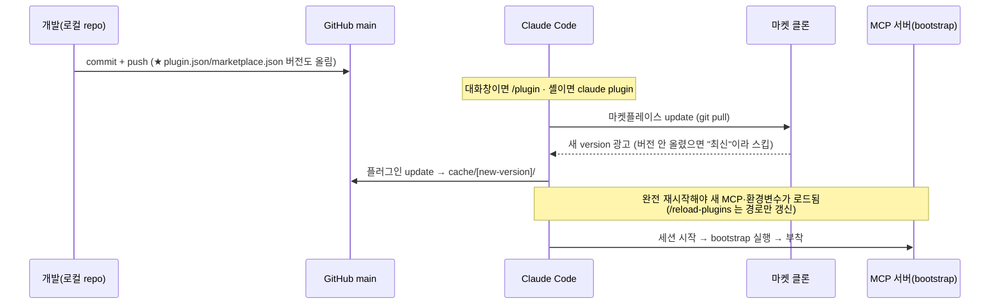
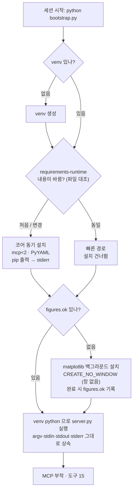
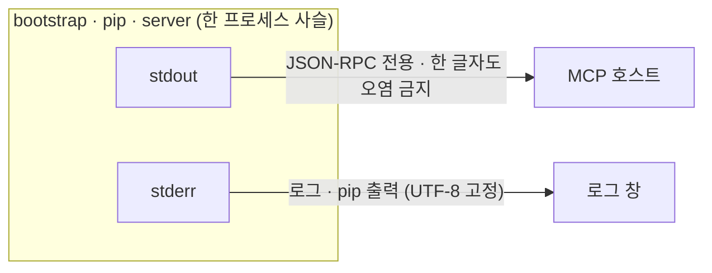
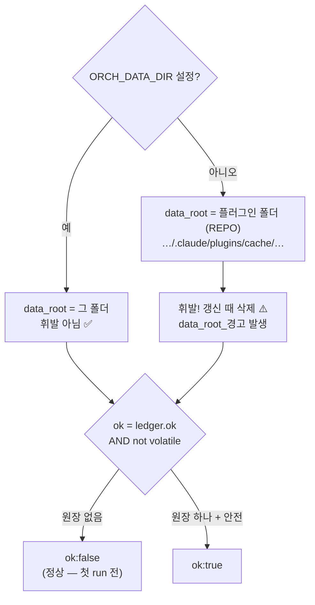

# antenna-orchestrator — MCP 플러그인 구축·운영 노트

> 이 플러그인을 배포·기동 가능한 상태로 만들며 실제로 부딪힌 문제와 그 해결을 개념도로 남긴다.
> **다음에 이 부분을 건드릴 때 같은 함정을 다시 파지 않기 위한 문서다.** 코드가 아니라 *왜 이렇게 됐는지*를 설명한다.

---

## 0. 한눈 요약 — 반복하지 말 것

| # | 증상 | 진짜 원인 | 해결 |
|---|---|---|---|
| 1 | MCP 도구(`orch_status` 등)가 안 붙음 | 앱이 쓰는 **시스템 python 에 `mcp`·`pyyaml` 없음**. Claude Code 는 `requirements.txt` 를 자동 설치하지 않음 | `bootstrap.py` 가 `${CLAUDE_PLUGIN_DATA}/venv` 에 **스스로** 설치 |
| 2 | 서버가 `mcp.server.fastmcp` 를 못 찾음 | `pip install mcp` 가 **2.0** 을 설치 → 구조가 바뀌어 그 경로가 사라짐 | `requirements-runtime.txt` 에서 **`mcp<2` 고정** |
| 3 | `/antenna-doc` 이 `/` 목록에 없음 | 플러그인 명령은 **`플러그인명:명령`** 으로 네임스페이스가 붙음 → `/antenna-orchestrator:antenna-doc` | 정상 동작. 슬래시 이름은 **폴더명** 기준(프론트매터 `name` 아님) |
| 4 | `/plugin ...` → CommandNotFound | 명령을 **PowerShell** 에 침 | `/plugin` 은 **Claude Code 대화창**, 셸에서는 **`claude plugin ...`** |
| 5 | 고친 게 앱에 반영 안 됨 | 앱은 **GitHub 클론**을 씀(로컬 폴더 아님), 게다가 **버전을 안 올리면** 갱신 안 받음 | **push + 버전 범프 + (마켓/플러그인) update + 완전 재시작** |
| 6 | 데이터가 갱신 때 사라짐 / `ok:false` | `ORCH_DATA_DIR` 미지정 → data_root 가 **휘발성 플러그인 폴더** | `setx ORCH_DATA_DIR <작업폴더>` 후 **완전 재시작** |
| 7 | 검은 콘솔 창이 뜸 | 백그라운드 설치를 `DETACHED_PROCESS` 로 띄움 → 자체 콘솔 창 | **`CREATE_NO_WINDOW`** 로 창 없이 실행 |
| 8 | (잠재) JSON-RPC 깨짐 | stdio 서버에서 **stdout 에 로그/pip 출력**이 섞임 | stdout 은 **오직 JSON-RPC**. 모든 로그·pip 출력은 **stderr** |
| 9 | `run_pipeline` 이 **응답 없이 30분** (직접 실행은 2.5초) | 렌더 노드의 **지연 `import matplotlib` 이 FastMCP 이벤트 루프 스레드 안에서** 처음 일어나 **교착**. FastMCP 는 동기 도구를 루프에서 직접 돌리고, 무거운 C-확장 import 가 그 안에서 데드락(Windows) | **서버 기동 시(루프 시작 전) matplotlib 을 미리 import** — 렌더 때 import 는 no-op |

---

## 1. 전체 구조 — 한 장의 지도



**핵심 개념 둘:**
- **두 표면(surface)은 독립이다.** *스킬*(`/antenna-orchestrator:antenna-doc`)은 MCP 서버가 죽어도 뜬다. *MCP 도구*는 서버가 붙어야 쓴다. "스킬은 보이는데 도구가 안 되는" 반쪽 상태가 그래서 생긴다.
- **앱은 로컬 폴더가 아니라 GitHub 클론을 쓴다.** 그래서 모든 개선은 `push` 로 시작한다.

---

## 2. 설치·갱신 흐름 — 왜 push·버전범프·재시작이 필요한가



> **버전 범프가 없으면 갱신이 없다.** `plugin.json` 의 `version` 이 캐시 키다. 같으면 "이미 최신"으로 건너뛴다.
> `version` 을 비우면 커밋 SHA 가 버전이 되어 매 커밋이 갱신으로 잡히지만, 우리는 명시 버전을 쓰므로 **올려야** 전달된다.

---

## 3. 기동 시퀀스 — bootstrap 자립 (핵심 설계)



**왜 2단(동기 코어 + 백그라운드 그림)인가**
- 서버가 **붙는 데 필요한 것**(`mcp`·`pyyaml`)만 **동기**로 깔아 첫 핸드셰이크를 빠르게 유지 → 부착 타임아웃 위험 최소화.
- `matplotlib` 는 `figures.py`·`render.py` 안에서 **지연 로드**라 기동엔 불필요 → **백그라운드**로 미룸(그림은 `run_pipeline` 때만 필요).
- **파일 내용 대조**(존재 여부 아님)로 재설치를 판정 → 플러그인 갱신으로 requirements 가 바뀌면 다음 세션이 알아서 다시 깐다.
- `langgraph` 는 **일부러 뺐다**: stdlib 대역 폴백이 있고, Python 3.14 휠이 없어 설치가 멈춘다(기본 python 이 3.14일 수 있음).

### stdio 규율 — stdout 은 성역



> stdio 전송에서 **stdout 은 JSON-RPC 통로**다. `print` 한 줄, pip 진행줄 하나라도 새면 프로토콜이 깨진다.
> 그래서 bootstrap 은 stdout 에 아무것도 안 쓰고, pip 은 `stdout=stderr` 로 돌리며, 로그는 stderr(UTF-8)로만 낸다.

---

## 4. data_root 결정 — 휘발 방지와 `ok` 판정



- `data_dir()`(tools/_common.py): `ORCH_DATA_DIR` 있으면 그 값, 없으면 `REPO`(= 코드 폴더 = `CLAUDE_PLUGIN_ROOT`).
- **`setx` 타이밍 함정**: `setx` 는 *이후 새로 뜨는* 프로세스에만 적용된다. 지금 도는 Claude Code 는 못 본다 → **완전 재시작**(가능하면 새 터미널)해야 MCP 서버가 물려받는다.
- `ok:false` 가 곧 고장은 아니다 — 원장이 없어서일 수도 있다(첫 `run_pipeline` 이 원장을 만든다).

---

## 5. 다음에 이 repo 를 건드릴 때 지킬 불변식

- [ ] **stdout 청정**: stdio 서버 경로에서 stdout 에 절대 로그를 쓰지 않는다. 로그·pip → stderr.
- [ ] **무거운 C-확장 import 는 기동 때 예열**: `matplotlib`·`numpy` 같은 것을 **도구 안에서 지연 import 하지 않는다** — FastMCP 는 동기 도구를 이벤트 루프 스레드에서 직접 돌리므로, 루프 안 첫 import 가 교착된다. `server.py` 에서 `mcp.run()` **전에** 미리 올린다.
- [ ] **`mcp<2` 유지**: FastMCP API(`mcp.server.fastmcp`)를 쓰는 한. 올리려면 `server.py` 를 2.x API 로 함께 고친다.
- [ ] **의존성은 bootstrap venv 로만**: 시스템 python 을 가정하지 않는다. 기동 임계는 `requirements-runtime.txt`(동기), 그림은 `requirements-figures.txt`(백그라운드).
- [ ] **Windows 백그라운드는 `CREATE_NO_WINDOW`**: `DETACHED_PROCESS` 는 검은 창을 띄운다.
- [ ] **변경을 배포하려면 버전 범프**: `plugin.json` + `marketplace.json` 둘 다. 그리고 push → update → **완전 재시작**.
- [ ] **슬래시 이름 = 폴더명**, 접두는 플러그인명. `/antenna-orchestrator:antenna-doc`.
- [ ] **데이터는 `ORCH_DATA_DIR` 밖으로**: 플러그인 폴더에 쌓으면 갱신 때 사라진다.
- [ ] **명령의 자리**: `/plugin`·`/reload-plugins` 는 대화창, `claude plugin ...` 는 셸.

---

## 6. 점검 명령

```bash
# 배선 점검 (SDK 불필요) — 도구 15 · 리소스 5
python mcp_server/server.py --list

# 알맹이만 (SDK 불필요)
python mcp_server/api.py

# 격리 환경에서 런타임 의존성 직접 설치
pip install -r mcp_server/requirements-runtime.txt

# 붙었는지 확인 (새 세션에서)
#   "orch_status 불러줘"  → data_root·ledger·ok 를 본다
```

**"직접은 되는데 MCP 로만 멈춘다" 를 잡는 법.** 도구를 in-process 로 부르면 되는데 MCP 경유만
멈추면, 원인은 대개 **이벤트 루프 안에서만 나타나는 것**(무거운 import·자기 이벤트 루프·stdout 블록)이다.
진짜 stdio 클라이언트(`mcp.client.stdio`)로 server.py 를 띄워 그 도구를 부르고, 서버 프로세스에
`faulthandler.dump_traceback_later(25, repeat=True, file=...)` 를 걸어 **멈춘 지점의 스택**을 파일로 뜬다.
루프 스레드에서 실제로 어느 줄이 블록되는지 그대로 보인다 — 추측 대신 스택으로 잡는다.
